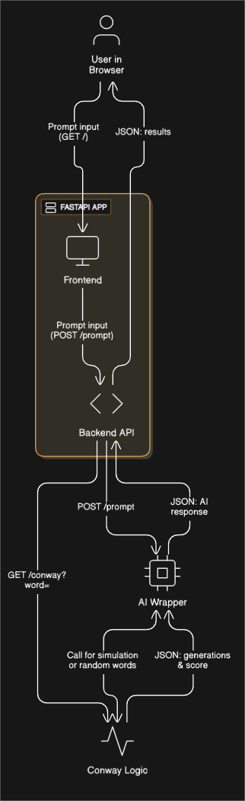

# Conway's Game of Life - AI Tool

A single-page web application that runs a custom Conway’s Game of Life (CGoL) seeded from the ASCII binary representation of an English word, and integrates an AI wrapper to answer LLM-style prompts. This project is a single FastAPI app that serves both the backend logic and the frontend.

This project was developed for the Monument AI coding challenge.

-----

## Architecture Diagram



-----

## Features

  * Convert any English word to an ASCII binary bitmask and seed a 60×40 Game of Life grid.
  * Run the CGoL simulation until a stable state, extinction, a repeating pattern (period \< 10), or 1,000 generations.
  * Return:
      * **generations** — number of generations until stability.
      * **score** — total number of cells that were ever alive during the simulation.
  * Provide a `/conway` API to run a single-word simulation.
  * Provide a `/prompt` API that accepts natural language prompts and uses an AI wrapper to:
      * Answer direct queries like “How many generations will the word 'monument' return…”
      * Generate three random words and report which has the highest Conway score.
  * The single command to run the app; the frontend is served from the same server.

-----

## Requirements

  * Python 3.11+ (recommended)
  * pip
  * (Optional) Docker for containerized deployment

-----

## Installation

```bash
# 1. Clone repo
git clone https://github.com/Aditya19Joshi01/CGoL.git
cd cgol_ai_tool

# 2. Create virtualenv (optional but recommended)
python -m venv .venv
source .venv/bin/activate       # Linux/macOS
.venv\Scripts\activate          # Windows

# 3. Install dependencies
pip install -r requirements.txt
```

### Run the app (single-command)

```bash
uvicorn app.main:app --reload
```

Open your browser to: `http://127.0.0.1:8000`

This single server hosts:

  * The web UI (served from `/`)
  * The Conway API (`GET /conway?word=<word>`)
  * The AI prompt endpoint (`POST /prompt`)

-----

## API Reference

### `GET /conway`

Run the Conway simulation for a given word.

**Request**

`GET /conway?word=monument`

**Response**

```json
{
    "word": "monument",
    "generations": 42,
    "score": 187
}
```

### `POST /prompt`

Send a natural language prompt to the AI wrapper. The server accepts form data (`prompt`) and returns JSON.

**Request (form-data or `application/x-www-form-urlencoded`)**

`prompt=How many generations will the word 'monument' return from the Conway tool?`

**Response**

```json
{
    "response": "The word 'monument' reached stability in 42 generations with a score of 187."
}
```

-----

## How the seed is created (word → grid)

Each character of the input word is converted to an 8-bit ASCII binary string (e.g., A → `01000001`).

The full binary bit sequence is treated as a linear stream of bits (`0` = dead, `1` = alive).

The bit stream is placed centered in the 60×40 grid. If the stream exceeds the remaining columns in a row, it wraps to the next row, so the seed forms a centered block.

This approach preserves the entire bitstream without truncation and creates richer seed patterns for longer words.

-----

## Simulation rules & stopping conditions

Standard Conway’s Game of Life rules (each cell checks its eight neighbors).

Stopping conditions (whichever occurs first):

  * **Extinction** — all cells dead.
  * **Stable** — the grid stays exactly the same from one generation to the next.
  * **Repeating** — a previously seen grid state is repeated with a period \< 10.
  * **Generation limit** — 1,000 generations reached.

-----

## Score definition

`Score` = total number of live cells spawned during the entire simulation (sum across all generations, counting each generation's live cells). This captures both longevity and spread.

-----

## Example usage (UI)

Open the UI at `http://127.0.0.1:8000`.

Type an LLM-style prompt into the textarea, for example:

  * `How many generations will the word 'monument' return from the Conway tool?`
  * `Generate 3 random words and tell me the highest Conway score.`

Click **Send** and view the response panel.

-----

## Future enhancements (ideas)

  * Visualize the grid evolution on the frontend (animated canvas or SVG).
  * Allow the user to upload or draw seed patterns in addition to words.
  * Persist simulation history to enable replay/share links.
  * Add server-side caching of results for repeated words.
  * Add Docker & `docker-compose` for easy deployment.
  * Add user authentication and per-user saved simulations (if required).

-----

## Transparency & Generative AI usage

Per the challenge instruction to be transparent about tool usage:

I used a generative AI assistant to speed up scaffolding, produce code skeletons, and draft UI/README content. Specifically, the AI helped with:

  * Implementing the core Game of Life logic and seed conversion (`cgol_logic.py`).
  * Building the FastAPI routes (`main.py`).
  * Creating the AI prompt wrapper (`gpt_wrapper.py`).
  * Creating the frontend files (`index.html`, `script.js`, `style.css`) used in this project.
  * Producing and polishing this `README.md`.

Everything included in the submission is my final reviewed code; AI outputs were edited and tested manually.
